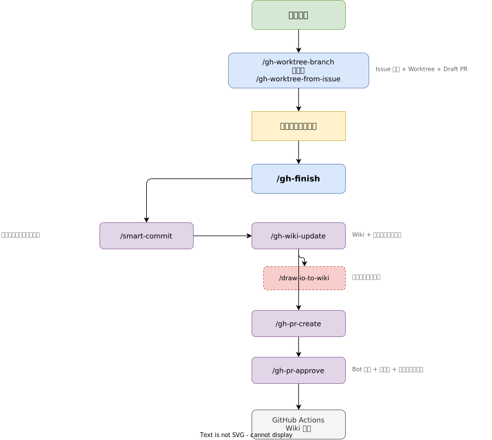

# 仕様書

Claude Code dotfiles の機能一覧と仕様です。

## スキル一覧

### Git ワークフロー

| スキル | コマンド | 説明 |
|--------|---------|------|
| gh-worktree-branch | `/gh-worktree-branch <説明>` | 新規 Issue 作成 → Worktree + ブランチ作成 → Draft PR |
| gh-worktree-from-issue | `/gh-worktree-from-issue [番号]` | 既存 Issue → Worktree + ブランチ作成 → Draft PR |
| gh-branch | `/gh-branch` | diff から Issue + ブランチ作成（Worktree なし） |
| gh-pr-create | `/gh-pr-create` | Draft PR を Ready for Review に変更し、承認・マージまで実行 |
| gh-pr-approve | `/gh-pr-approve` | Bot で PR 承認 → マージ → Issue クローズ → Worktree 削除 |
| gh-finish | `/gh-finish` | 状況を自動判定し、Issue 作成〜マージまで一括実行 |

※ `gh-finish` は 2026-02-26 時点でサブスキル委譲をなくし、完全インライン実行に刷新。

### コーディング

| スキル | コマンド | 説明 |
|--------|---------|------|
| smart-commit | `/smart-commit` | 変更をテーマ別に分割し Conventional Commits 形式でコミット |

### ユーティリティ

| スキル | コマンド | 説明 |
|--------|---------|------|
| z-cheatsheet | `/z-cheatsheet` | dotfiles のショートカット・コマンド検索 |
| z-cheatsheet-add | `/z-cheatsheet-add` | チートシートに項目を追加 |
| gh-wiki-update | `/gh-wiki-update` | コード変更から Wiki ドキュメントを自動更新 |
| gh-init-wiki | `/gh-init-wiki` | Wiki 初期セットアップ（ダイアグラム含む） |
| draw-io-to-wiki | `/draw-io-to-wiki <説明>` | draw.io ダイアグラムを作成し SVG で Wiki に追加 |

## ワークフロー

### 作業開始から完了まで



> [draw.io ソースファイル](./images/skill-workflow.drawio) で編集できます

```
フェーズ1: GitHub 準備
    /gh-worktree-branch "機能追加"  または  /gh-worktree-from-issue 123
        │
        ├── Issue 作成 + Draft PR
        └── Worktree + ブランチ作成

フェーズ2: AI 駆動開発
    コーディング作業（main / branch / worktree）

フェーズ3: GitHub 統合
    /gh-finish
        │
        ├── コミット（テーマ別）
        ├── Wiki 更新（docs/wiki/）
        ├── PR Ready for Review
        ├── Bot 承認・マージ
        └── Issue クローズ・ブランチ削除
            │
            ▼
        GitHub Actions: docs/wiki/ → Wiki 同期
```

### Wiki 更新の仕組み

- `/docs/wiki/` 配下の Markdown ファイルがドキュメントの正（ソース）
- コード変更時に `/gh-wiki-update` スキルが `/docs/wiki/` を更新
- main ブランチにマージされると GitHub Actions が Wiki リポジトリに自動同期

### ダイアグラム管理

- `/draw-io-to-wiki` で draw.io ダイアグラムを作成し SVG にエクスポート
- `/gh-wiki-update` はコード変更時に既存ダイアグラムの更新も自動判定
- `/gh-init-wiki` は初期化時にアーキテクチャ図等のダイアグラムも生成
- ソースファイル（`.drawio`）と出力（`.svg`）の両方を `docs/wiki/images/` に保持
- SVG エクスポートは `xvfb-run drawio --export` で CLI 実行

## 通知

| イベント | 通知内容 | サウンド |
|---------|---------|---------|
| Stop（応答完了） | 処理が完了しました | Reminder |
| Notification（入力待ち） | 許可または入力を待っています | IM |

---

*最終更新: 2026-02-26 (SKILL.md 全面改訂・gh-finish インライン化)*
