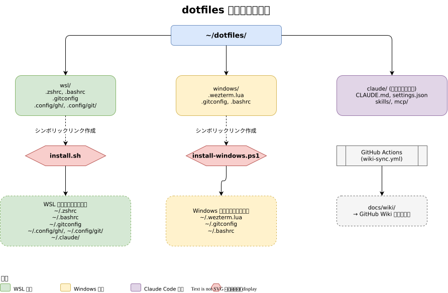

# 仕様書

## 全体構成

```
~/dotfiles/
├── install.sh              # WSL 用インストーラ
├── install-windows.ps1     # Windows 用インストーラ
├── wsl/                    # WSL Ubuntu 設定ファイル
├── windows/                # Windows 設定ファイル
├── claude/                 # Claude Code 設定（サブモジュール）
└── wsl/.local/bin/         # WSL 補助スクリプト
```



## コンポーネント一覧

### install.sh（WSL インストーラ）

| 項目 | 内容 |
|------|------|
| 動作 | 設定ファイルのシンボリックリンクを作成 |
| 冪等性 | あり（何度実行しても安全） |
| バックアップ | 既存ファイルを `*.backup.YYYYMMDD` に退避 |
| 対象 | `.zshrc`, `.bashrc`, `.gitconfig`, `gh/config.yml`, `git/ignore`, Claude 設定一式 |

### install-windows.ps1（Windows インストーラ）

| 項目 | 内容 |
|------|------|
| 動作 | Windows 側のシンボリックリンクを作成 |
| 要件 | 管理者権限または Developer Mode |
| 対象 | `.wezterm.lua`, `.gitconfig`, `.bashrc` |

### WSL 設定ファイル

#### .zshrc

| 機能 | 説明 |
|------|------|
| プロンプト | `adam1` テーマを使用 |
| 履歴 | 1000 行、重複除去、シェル間共有 |
| 補完 | zsh 標準の高度な補完システム |
| zoxide | `z` コマンドによるスマートディレクトリ移動 |
| cfd() | fzf でカレントディレクトリ配下のフォルダを選択して cd |
| OSC 7 | WezTerm にカレントディレクトリを通知 |

### WSL 補助スクリプト

#### backup-wsl-full

| 項目 | 内容 |
|------|------|
| 動作 | `wsl.exe --export` でディストリ全体を `.tar` 化し、`rclone` でクラウドへ転送 |
| 一時置き場 | `C:\Users\<WindowsUser>\AppData\Local\WSLBackups\tmp` |
| 保存先 | `gdrive:WSL-FullBackups/<distro>/` |
| 保持 | 30 日より古い `.tar` を削除 |
| 失敗時 | upload 失敗時はローカル `.tar` を保持 |
| 制約 | 実行中の現在ディストリ自身は WSL 内から terminate せず、そのまま export |

### devbox（Linux）設定ファイル

#### .tmux.conf

セッション層の本体。WezTerm から見た Window / Tab / Pane は実体としてここで管理される（#214）。

| 機能 | 説明 |
|------|------|
| prefix | `Ctrl+q`（`Ctrl+b` も `prefix2` として有効） |
| prefix を2つ持つ理由 | `.wezterm.lua` の `tmux_bridge` が `\x02`（= `Ctrl+b`）を送るため、`Ctrl+b` を外すと WezTerm 側のショートカットが全滅する。`Ctrl+q` は WezTerm が Leader として食うので、直接効くのは iPad / Termius / 素の `ssh` から入ったとき |
| セッション永続化 | tmux-resurrect。cron が 15 分ごとに保存し、サーバー起動時に `tmux-autorestore` が一度だけ復元する |
| ペイン名 | `@name` をペイン上辺のボーダーに常時表示。`tmux-pane-names` が resurrect フックで別ファイルに保存・復元する |
| Claude Code の会話復元 | `tmux-claude-sessions` がペインごとにセッション ID を記録し、復元時に `claude --resume` で個別に再開する |
| WezTerm タブバー連携 | ウィンドウ構成が変わるたび `wezterm-tabs-sync` が SetUserVar で一覧を通知する |

### Windows 設定ファイル

#### .wezterm.lua

> #214 以降、Window / Tab / Pane の管理は devbox 上の tmux に一本化した。
> WezTerm は表示器 + SSH クライアントで、下表の分割・ペイン系キーは
> `tmux_bridge` が tmux の prefix シーケンス（`Ctrl+b` + キー）に変換して送っている。
> WezTerm 独自の Workspace 機能は使っていない（tmux セッションが代替）。

| 機能 | キー / 説明 |
|------|------------|
| デフォルトドメイン | `devbox-tmux`（ネイティブ SSH + tmux。起動時のウィンドウはここに生成される） |
| Leader キー | `Ctrl+q`（2秒タイムアウト）。待ち受け中は右ステータスに `LEADER` と表示 |
| タブバー | 常時表示（タブ1つでも隠さない）。tmux のウィンドウ一覧を1つのタブ枠に並べて描画する |
| タイトルバー | 非表示（`window_decorations = "RESIZE"`） |
| 透過 | `window_background_opacity = 1.0`（背景は不透過。タブバーのみ透過） |
| 左右分割 | `Ctrl+q` → `r`（tmux の `prefix + \|`） |
| 上下分割 | `Ctrl+q` → `d`（tmux の `prefix + -`） |
| ペイン移動 | `Alt+h/l/k/j`（端まで来たらペイン内アプリへ透過） |
| ペイン閉じ | `Ctrl+q` → `x`（確認なし） |
| コピーモード | `Ctrl+q` → `[`（vi ライク） |
| タブ（tmux ウィンドウ）一覧から選択 | `Ctrl+q` → `w` |
| タブ（tmux ウィンドウ）名変更 | `Ctrl+q` → `t` |
| セッション一覧から選択 | `Ctrl+q` → `s` |
| セッション新規作成 | `Ctrl+q` → `n`（名前を聞かれ、そのまま移動） |
| ペインを別ウィンドウ/セッションへ移動 | `Ctrl+q` → `m`（一覧から移動先を選択） |
| ステータスバー | 右端に接続先ラベル・`LEADER` 待機表示・日時を表示 |
| ウィンドウタイトル | カレントディレクトリ名を表示（`<dir> - WezTerm`） |
| キーバインド定義 | `windows/.wezterm.lua`（インライン管理） |

ショートカットの全量は `docs/qiita/terminal-shortcuts.md` を参照。

### Claude Code 設定（サブモジュール）

Git サブモジュールとして管理される外部リポジトリ。

| 内容 | 説明 |
|------|------|
| CLAUDE.md | グローバルルール（コーディング規約、GitHub 運用ルール） |
| settings.json | Claude Code の設定 |
| skills/ | 自動化スキル（Git Worktree、PR 作成、Wiki 更新 等） |
| mcp/ | MCP サーバー設定 |

## 前提条件

### WSL 側

- zsh
- zoxide（スマート cd）
- fzf（ファジーファインダー）
- gh（GitHub CLI）
- rclone（クラウド転送）
- Claude Code

### Windows 側

- WezTerm（ターミナルエミュレータ）
- Developer Mode（シンボリックリンク作成に必要）

## シンボリックリンク一覧

| ソース（dotfiles 内） | リンク先（実際に使われる場所） |
|----------------------|--------------------------|
| `wsl/.zshrc` | `~/.zshrc` |
| `wsl/.bashrc` | `~/.bashrc` |
| `wsl/.gitconfig` | `~/.gitconfig` |
| `wsl/.config/gh/config.yml` | `~/.config/gh/config.yml` |
| `wsl/.config/git/ignore` | `~/.config/git/ignore` |
| `wsl/.local/bin/backup-wsl-full` | `~/.local/bin/backup-wsl-full` |
| `wsl/.local/bin/gf` | `~/.local/bin/gf` |
| `claude/CLAUDE.md` | `~/.claude/CLAUDE.md` |
| `claude/settings.json` | `~/.claude/settings.json` |
| `claude/skills/*` | `~/.claude/skills/*` |
| `windows/.wezterm.lua` | Windows `~/.wezterm.lua` |
| `windows/.gitconfig` | Windows `~/.gitconfig` |
| `windows/.bashrc` | Windows `~/.bashrc` |
